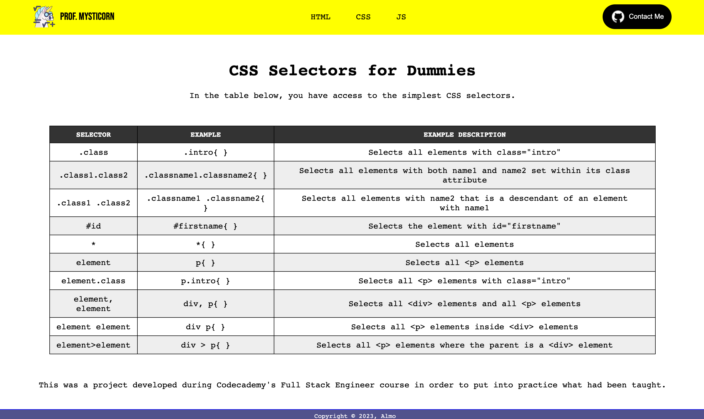

# Codecademy CheatSheetChallenge

# Objective
The aim of this project is to solve a challenge from Codecademy's Full Stack Engineer course, in which we have to create a CheatSheet using a concept we've learned.